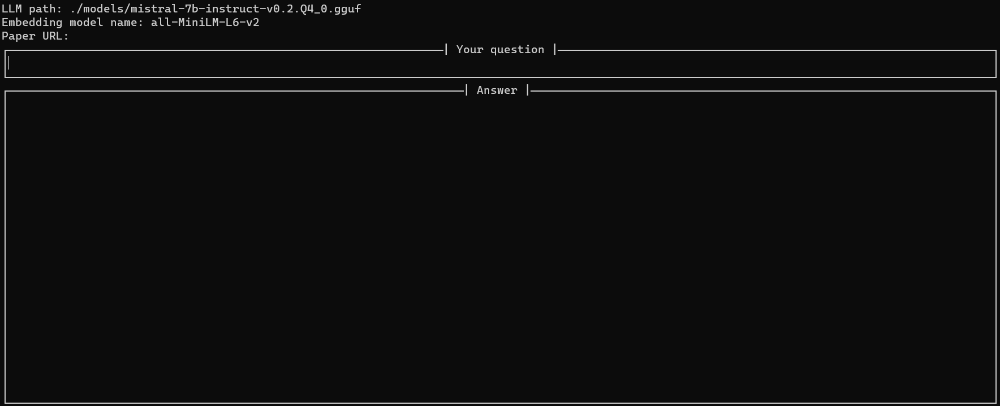
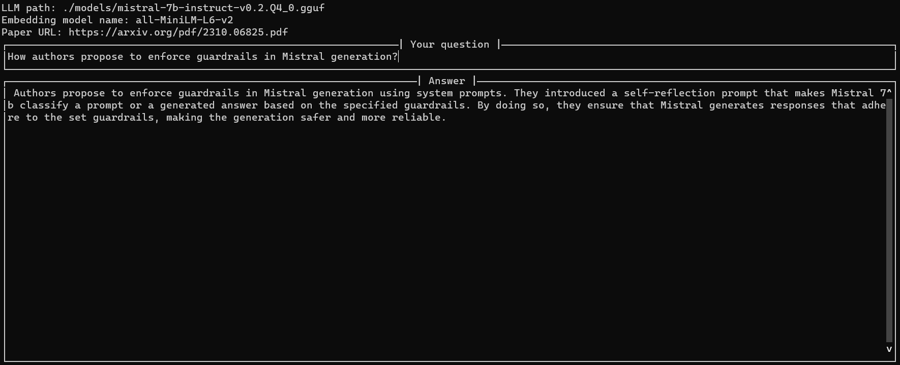

# LLM Paper Reader
This repository provides LLM-based tool that answers questions about provided scientific paper. It was built using [LangChain](https://github.com/langchain-ai/langchain), [llama.cpp](https://github.com/ggerganov/llama.cpp), [llama-cpp-python](https://github.com/abetlen/llama-cpp-python), and [faiss](https://github.com/facebookresearch/faiss), with command-line interface implemented with [python-prompt-toolkit](https://github.com/prompt-toolkit/python-prompt-toolkit).

## Installation

To use available accelerators, make sure to install [llama.cpp](https://github.com/ggerganov/llama.cpp) with proper settings (for more details check out [llama-cpp-python](https://github.com/abetlen/llama-cpp-python?tab=readme-ov-file#installation-with-specific-hardware-acceleration-blas-cuda-metal-etc) Installation guide, the following instructions are heavily based on it):

### OpenBLAS

To install with OpenBLAS, set the `LLAMA_BLAS and LLAMA_BLAS_VENDOR` environment variables before installing:

```bash
CMAKE_ARGS="-DLLAMA_BLAS=ON -DLLAMA_BLAS_VENDOR=OpenBLAS" pip install -r requirements.txt
```

### cuBLAS

To install with cuBLAS, set the `LLAMA_CUBLAS=1` environment variable before installing:

```bash
CMAKE_ARGS="-DLLAMA_CUBLAS=on" pip install -r requirements.txt
```

### Metal

To install with Metal (MPS), set the `LLAMA_METAL=on` environment variable before installing:

```bash
CMAKE_ARGS="-DLLAMA_METAL=on" pip install -r requirements.txt
```

### CLBlast

To install with CLBlast, set the `LLAMA_CLBLAST=1` environment variable before installing:

```bash
CMAKE_ARGS="-DLLAMA_CLBLAST=on" pip install -r requirements.txt
```

### hipBLAS

To install with hipBLAS / ROCm support for AMD cards, set the `LLAMA_HIPBLAS=on` environment variable before installing:

```bash
CMAKE_ARGS="-DLLAMA_HIPBLAS=on" pip install -r requirements.txt
```

## How to use

### Preparation

You need to make sure that you have downloaded the model that you want to use (in GGUF format, so it's compatible with [llama.cpp](https://github.com/ggerganov/llama.cpp)). You can either download it directly (for example, [TheBloke](https://github.com/TheBloke) [Tony Jobbins] provides a ton of great converted checkpoints at https://huggingface.co/TheBloke). If you want to use the default model ([Mistral 7B Instruct 0.2](https://huggingface.co/mistralai/Mistral-7B-Instruct-v0.2)), you can run the following command to download [GGUF version](https://huggingface.co/TheBloke/Mistral-7B-Instruct-v0.2-GGUF) from [TheBloke](https://github.com/TheBloke) (quantized into 4-bit):

```bash
wget download_mistral.sh
```

### Launching the app

After that, everything is ready to launch the app! To do so, simple run:

```bash
python main.py
```

It will open command-line interface, that will look like this: 

Here you can update path to the LLM (with the checkpoint that you downloaded in the previous stage), embedding model used to retrieve relevant parts of the paper (if you use paper in English, then you can keep the default value), as well as provide URL for paper that you want to analyze. After that, enter your question in `Your question` field, and wait a little bit until the answer will start to appear! Here is the example of the answered question: 


